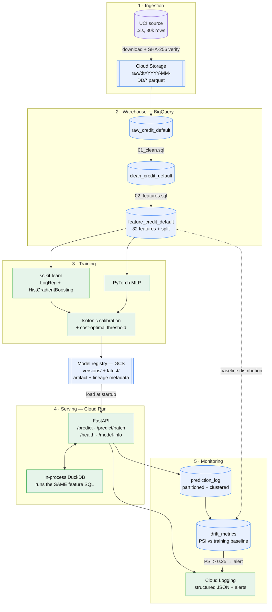

# Credit Default Risk — End-to-End ML Pipeline on GCP

## Overview

An end-to-end machine learning system that predicts whether a credit-card client
will default next month, built the way it would be built for production rather
than as a notebook. It covers every stage: **ingest → warehouse → SQL features →
train → calibrate → decide → serve → monitor**, plus infrastructure as code and
CI.

**Data:** [UCI #350](https://archive.ics.uci.edu/dataset/350/default+of+credit+card+clients)
(Yeh & Lien, 2009) — 30,000 Taiwanese accounts, April–September 2005, 22.1% default rate.

| Stage | What happens | Tech |
|---|---|---|
| 1 · Ingest | Download, SHA-256 verify, stage as Parquet, load to warehouse | GCS / filesystem |
| 2 · Features | 32 features + deterministic 70/15/15 split, defined **once in SQL** | BigQuery / DuckDB |
| 3 · Train | LogReg + HistGradientBoosting, and a PyTorch MLP wrapped as a sklearn estimator | scikit-learn, PyTorch |
| 4 · Decide | Isotonic calibration, then a threshold chosen to minimise **expected cost**, not maximise accuracy | — |
| 5 · Serve | REST API taking **raw** account fields; runs the same feature SQL in-process | FastAPI, DuckDB, Cloud Run |
| 6 · Monitor | Prediction log + PSI input drift vs training baseline, alerting on shift | BigQuery, Cloud Logging |

**Headline results** (held-out test set, touched once): ROC-AUC **0.789**,
PR-AUC **0.538**, and a decision policy that cuts expected loss **27%** versus the
best trivial baseline. The PyTorch net did *not* beat gradient boosting — that is
reported, not hidden.

**Three ideas hold it together:**

1. **One definition of a feature.** The same `sql/*.sql` files run in the
   warehouse during training and inside the API at request time, so
   training/serving skew is structurally impossible, not merely unlikely.
2. **Two backends, one codebase.** `backend: local` (DuckDB + filesystem) and
   `backend: gcp` (BigQuery + Cloud Storage) sit behind one interface — so the
   whole thing runs on any laptop with no cloud account, while the GCP path stays
   real SDK code.
3. **A decision, not a score.** Predicting "nobody defaults" scores 78% accuracy
   and is worthless; the pipeline optimises the cost of the two errors instead.

> **Status:** validated end-to-end locally. The GCP path (`terraform/`, BigQuery
> and GCS clients) is written and reviewable but has **never been applied against
> a live billing account** — see [Deploying to GCP](#deploying-to-gcp).

### How to use it

```bash
git clone <this-repo> && cd credit-default-risk
pip install -r requirements-dev.txt

make pipeline        # ingest -> features -> train -> evaluate -> register  (~25 s)
make test            # 66 tests, no cloud credentials, no network
make serve           # API on :8080 — interactive docs at /docs
```

Then POST raw client fields to `/predict` and get back a calibrated probability,
the cost-optimal threshold, a `flag` / `no_flag` decision and a risk band — see
[Running it](#running-it) for a worked request. Everything above costs **nothing
and needs no GCP account**; adding `CR__BACKEND=gcp` is the only change needed to
run the identical code against BigQuery and Cloud Storage.

---

## Contents

- [Architecture](#architecture)
- [Results](#results)
- [Design decisions](#design-decisions)
- [Two backends, one codebase](#two-backends-one-codebase)
- [Repository layout](#repository-layout)
- [Running it](#running-it)
- [Deploying to GCP](#deploying-to-gcp)
- [Monitoring](#monitoring)
- [Testing](#testing)
- [Limitations and next steps](#limitations-and-next-steps)

---

## Architecture



**Feature SQL is the single source of truth.** The same `sql/*.sql` files run in
BigQuery during training and inside the API at request time — the dashed and
solid paths into `02_features.sql` are literally the same file. That is what
makes training/serving skew structurally impossible rather than merely unlikely.

---

## Results

Held-out test set (4,500 clients, touched exactly once). Full report:
[`reports/model_report.md`](reports/model_report.md).

| Model | Algorithm | ROC-AUC | PR-AUC | Brier | Precision | Recall | F1 | Savings vs best baseline |
|---|---|---|---|---|---|---|---|---|
| scikit-learn | HistGradientBoosting | **0.7894** | 0.5377 | 0.1372 | 0.3692 | 0.7882 | 0.5028 | **27.0%** |
| PyTorch | MLP (128→64) | 0.7846 | **0.5383** | **0.1367** | 0.3627 | 0.8020 | 0.4995 | **27.1%** |

Model selection on validation PR-AUC: HistGradientBoosting **0.5706** vs
logistic regression **0.5187**.

**The neural network did not beat gradient boosting** — the two are within noise
of each other (ΔPR-AUC = 0.0006). That is the expected result for tabular data of
this size, and it is reported rather than buried: the gradient booster trains in
seconds, is far easier to explain to a risk committee, and is what the config
serves by default.

### The decision, not just the score

Accuracy is the wrong metric here. Predicting "no default" for everyone scores
**78% accuracy** and is worthless. The two errors also cost different amounts, so
the pipeline optimises expected cost:

| Policy | Total cost (NT$) | Note |
|---|---|---|
| Intervene with nobody | 16,240,000 | every default written off |
| Intervene with everybody | 11,977,500 | every good client needlessly restricted |
| **Model @ threshold 0.182** | **8,741,000** | **saves NT$3,236,500 (27.0%)** |

The threshold is derived from a cost matrix grounded in the data — median balance
at default is NT$20,185, so loss given default ≈ NT$16,000 at a 20% recovery rate
— not chosen at 0.5 by default. The implied boundary is
`p* = FP / ((FN − TP) + FP) = 0.171`; the empirical optimum found on validation
was **0.182**. `reports/model_report.md` includes a sensitivity sweep showing how
the operating point moves if Risk disagrees with those figures.

### Calibration

Probabilities are isotonic-calibrated on validation data, so a score of 0.7 means
roughly 70% of such clients default — which is what makes the cost threshold
meaningful. Top decile: **0.720 predicted vs 0.720 observed**. Worst decile gap
across all ten: 0.043.

### Fairness

`sex` is excluded from the feature set but retained for auditing, because
exclusion alone does not guarantee equal treatment — correlated features can
reproduce the same disparity.

| Group | n | Actual default rate | Selection rate | Recall | Precision | ROC-AUC |
|---|---|---|---|---|---|---|
| male | 1,829 | 0.2564 | 0.5068 | 0.7910 | 0.4002 | 0.7834 |
| female | 2,671 | 0.2044 | 0.4642 | 0.7857 | 0.3460 | 0.7924 |

Recall is near-identical (0.791 vs 0.786) and discrimination is comparable. The
4.3pp selection-rate gap tracks a genuine 5.2pp difference in base default rate
rather than the model treating equivalent clients differently — but precision
differs (0.400 vs 0.346), meaning a flagged female client is less likely to be a
true defaulter. In a regulated deployment that gap is the finding that would need
sign-off, not a footnote.

### Serving latency

Measured locally, warm (`sklearn` flavour, single instance):

| | p50 | p95 | p99 |
|---|---|---|---|
| Single record | 17.3 ms | 30.6 ms | 61.1 ms |
| Batch of 200 | — | — | 0.11 ms/record |

Most of the single-record cost is the in-process feature SQL. That is the
deliberate price of eliminating training/serving skew; batching amortises it away
almost entirely.

---

## Design decisions

The parts worth arguing about.

### 1. Feature engineering in SQL, not pandas

Feature logic lives in [`sql/02_features.sql`](sql/02_features.sql) and executes
in the warehouse. It is reviewable by analysts who read SQL but not Python, it
runs unchanged whether the table holds 30k rows or 30M, and it gives training and
serving one shared definition instead of two that drift.

### 2. Temporal alignment of payment ratios

`pay_amt_i` is the payment made during month *i*, and it settles the statement
issued the month *before* — `bill_amt_(i+1)`. Dividing by the same month's bill
would compare a payment against a statement that had not been issued when the
payment was made: a subtle lookahead that inflates offline metrics and vanishes
in production. A dedicated test pins this.

### 3. Missingness that carries signal

`overall_payment_ratio` is NULL for 1,258 dormant accounts with no statements in
months 2–6. Those accounts default at **31.6% against a 22.1% base rate** — the
absence of billing history is itself a risk signal. Rather than filling it with
zero (which would assert "paid nothing against a bill" and destroy the signal),
the NULL is preserved and a `has_billing_history` flag makes it explicit.
Gradient boosting consumes the NULL natively; logistic regression gets a median
fill plus the flag.

### 4. Deterministic hash-based splitting

Splits come from `MOD(client_id * 2654435761, 100)` — pure integer arithmetic, so
BigQuery and DuckDB produce byte-identical assignments. `FARM_FINGERPRINT` and
DuckDB's `HASH` return different values, which would mean a model validated
locally was evaluated on different rows in production.

Because assignment depends only on `client_id`, it is stable as the table grows:
a client can never migrate from test into train and leak. A random shuffle
reassigns everyone on every run. Both properties are tested.

The result is 70/15/15 with class balance preserved (0.219 / 0.226 / 0.226
against 0.221 overall) with no explicit stratification, because the hash is
independent of the target.

### 5. Calibrate, then threshold

Gradient boosting optimises log-loss and class weighting distorts its scores
further, so raw outputs are not probabilities. The winner is frozen
(`FrozenEstimator`, so calibration cannot refit and leak), isotonic-calibrated on
validation, and only then thresholded.

Three splits, each with exactly one job: hyperparameters are searched with
cross-validation inside **train**; calibration and threshold are fitted on
**valid**; **test** is touched once. Selecting a threshold on test is the most
common way portfolio projects quietly overstate their results.

### 6. The API takes raw data, not features

Requiring callers to submit engineered features pushes
[`sql/02_features.sql`](sql/02_features.sql) into every client, and the first one
to round a ratio differently silently diverges from training. Instead the API
accepts raw account fields and runs the same SQL in-process via DuckDB.
`test_serving_features_match_warehouse_features` asserts all 32 features match
the warehouse to 1e-9.

### 7. PyTorch instead of TensorFlow

TensorFlow publishes no cp314 wheels, so it cannot be installed on the Python
3.14 environment this was built on. PyTorch 2.12 works. The network is wrapped in
a scikit-learn-compatible estimator, so it flows through the *same* calibration,
threshold selection, evaluation, registry and serving code — making the
comparison genuinely like-for-like rather than two separate pipelines.

---

## Two backends, one codebase

Every warehouse interaction goes through a small
[`Warehouse`](src/credit_risk/warehouse/base.py) interface with two
implementations:

| | `backend: local` | `backend: gcp` |
|---|---|---|
| Warehouse | DuckDB | BigQuery |
| Object storage | filesystem | Cloud Storage |
| Feature SQL | **identical files** | **identical files** |

Switching is one config value or one environment variable:

```bash
CR__BACKEND=gcp CR__GCP__PROJECT_ID=my-project make pipeline
```

The SQL is restricted to constructs both engines share — no `SAFE_DIVIDE`, no
`FARM_FINGERPRINT`, no `FLOAT64`/`DOUBLE` casts; division guards use the portable
`x / NULLIF(y, 0)` form. This means anyone can clone the repo and run the whole
thing, CI needs no cloud credentials, and the GCP path is real SDK code rather
than a mock.

---

## Repository layout

```
├── config/config.yaml          # single source of truth, env-overridable
├── sql/
│   ├── 01_clean.sql            # codebook-driven cleaning, dedup guard
│   └── 02_features.sql         # 32 features + deterministic split
├── src/credit_risk/
│   ├── config.py               # typed settings, fail-fast GCP validation
│   ├── pipeline.py             # orchestration CLI
│   ├── logging_config.py       # Cloud Logging JSON formatter
│   ├── storage.py              # BlobStore: filesystem | GCS
│   ├── warehouse/              # Warehouse: DuckDB | BigQuery
│   ├── ingest/                 # download + checksum, GCS staging, load
│   ├── features/build.py       # SQL runner + invariant validation
│   ├── training/
│   │   ├── evaluate.py         # PR-AUC, cost curve, calibration, fairness
│   │   ├── train_sklearn.py    # search, calibrate, threshold, register
│   │   ├── train_torch.py      # MLP as a sklearn-compatible estimator
│   │   └── registry.py         # versioned artifacts + lineage metadata
│   ├── serving/                # FastAPI, pydantic schemas, predictor
│   └── monitoring/             # prediction log, PSI drift
├── tests/                      # 66 tests, no cloud credentials needed
├── scripts/devtools.py         # cross-platform Makefile helpers
├── docker/Dockerfile           # multi-stage, non-root, CPU-only torch
├── terraform/                  # BigQuery, GCS, Cloud Run, IAM, alerts
└── .github/workflows/ci.yml    # lint, test matrix, e2e pipeline, image build
```

---

## Running it

```bash
make setup           # install dependencies
make pipeline        # full run: ingest -> features -> train -> report
make test            # 66 tests
make lint            # ruff check + format --check
make serve           # API on :8080, interactive docs at /docs
```

Individual stages:

```bash
make ingest          # download + checksum + load to warehouse
make features        # rebuild the feature table from SQL
make train-sklearn   # train one flavour only
make drift           # PSI of served predictions vs training baseline
```

Example request:

```bash
curl -X POST http://localhost:8080/predict \
  -H 'Content-Type: application/json' \
  -d '{"client_id":1,"limit_bal":20000,"sex":2,"education":2,"marriage":1,"age":24,
       "pay_status_1":2,"pay_status_2":2,"pay_status_3":-1,"pay_status_4":-1,
       "pay_status_5":-2,"pay_status_6":-2,
       "bill_amt_1":3913,"bill_amt_2":3102,"bill_amt_3":689,
       "bill_amt_4":0,"bill_amt_5":0,"bill_amt_6":0,
       "pay_amt_1":0,"pay_amt_2":689,"pay_amt_3":0,
       "pay_amt_4":0,"pay_amt_5":0,"pay_amt_6":0}'
```

```json
{
  "client_id": 1,
  "default_probability": 0.6842,
  "decision": "flag",
  "threshold": 0.1818,
  "risk_band": "high",
  "model_version": "20260720T130948Z"
}
```

---

## Deploying to GCP

> **Status:** the GCP path is written and reviewable but has not been applied
> against a live billing account. Everything in `terraform/` and the BigQuery /
> GCS clients is real SDK code, not stubs, and the pipeline was validated
> end-to-end on the DuckDB backend. Claiming a live deployment that was never run
> would be the kind of thing worth catching in an interview.

```bash
cd terraform
cp terraform.tfvars.example terraform.tfvars   # set project_id
terraform init && terraform apply

gcloud auth configure-docker $(terraform output -raw artifact_registry | cut -d/ -f1)
docker build -f docker/Dockerfile -t $(terraform output -raw artifact_registry)/api:v1 .
docker push $(terraform output -raw artifact_registry)/api:v1
terraform apply                                 # roll the service onto the image

curl $(terraform output -raw service_url)/health
```

`make deploy-info` prints this sequence.

Terraform provisions BigQuery (partitioned + clustered monitoring tables with
declared schemas), two GCS buckets with lifecycle rules, Artifact Registry, a
least-privilege service account, the Cloud Run service with liveness/startup
probes, and two Cloud Monitoring alert policies.

**Cost:** as configured this fits inside the GCP free tier for portfolio-scale
use — Cloud Run scales to zero, BigQuery's 1 TB/month free query allowance dwarfs
a megabyte-scale dataset, and the buckets sit well under 5 GB. `max_instances`
caps the blast radius of a traffic spike.

---

## Monitoring

**Structured logging.** Logs are emitted as one JSON object per line with the
fields Cloud Logging recognises (`severity`, `message`, trace correlation), so
they are queryable rather than an unstructured blob:

```
severity>=ERROR AND jsonPayload.endpoint="/predict"
```

**Prediction logging.** Every served prediction is written to a partitioned,
clustered BigQuery table with its inputs, score, decision and model version.
Writes are buffered, and failures are logged and swallowed — monitoring must
never fail a prediction.

**Drift detection.** Labels arrive a month late, so input drift is the practical
early warning. PSI is computed per feature against the training baseline using
baseline-derived bin edges (re-binning on production data would rescale both
distributions and hide the shift). Validated behaviour:

| Shift | PSI | Status |
|---|---|---|
| identical | 0.003 | stable |
| +0.25σ | 0.063 | stable |
| +0.5σ | 0.212 | warn |
| +1.0σ | 0.892 | alert |
| variance ×2 | 0.512 | alert |

An alert logs at ERROR severity, which the Terraform log-based alert policy pages
on.

---

## Testing

```
66 tests · no GCP credentials · no network · runs on every PR
```

The suite targets the things that break quietly:

- **cost curve verified against brute force**, including the heavy-tie case that
  isotonic calibration produces — a cut point inside a run of tied probabilities
  is not an achievable operating point, and treating it as one reports an
  optimum that does not exist
- **temporal alignment** of payment ratios (the lookahead guard)
- **split stability** — adding new clients must not reassign existing ones
- **serving/training skew** — all 32 features must match the warehouse to 1e-9
- **PSI edge cases** — disjoint support must stay finite, NaNs ignored not counted
- **monitoring cannot break serving** — a dead warehouse must not fail a request

---

## Limitations and next steps

Honest gaps, in the order I would address them.

1. **Not deployed live.** See the note above. The Terraform has been written and
   reviewed but never `apply`-ed against a billing account.
2. **No true temporal validation.** The dataset is a single six-month snapshot
   with no timestamps, so the split is hash-based rather than time-based. Real
   credit models must be validated out-of-time, because economic conditions shift
   underneath them. With a dated dataset I would train on months 1–4 and validate
   on 5–6.
3. **The cost matrix is an estimate.** It is grounded in observed balances and a
   published recovery rate, but a real deployment would take these numbers from
   Finance. The sensitivity sweep exists precisely because the single point
   estimate should not be trusted on its own.
4. **The fairness gap needs owning.** Equal recall but unequal precision across
   `sex` is a real finding. Next step would be threshold calibration per group or
   an equalised-odds post-processing step — both of which carry their own legal
   trade-offs and would need sign-off rather than a unilateral engineering choice.
5. **No feature store.** Feature definitions are versioned with the code, which
   is fine at this scale but would not support point-in-time correctness across
   many models sharing features.
6. **Single-region, no canary.** Cloud Run traffic goes 100% to latest. A real
   rollout would split traffic and compare live metrics before promoting.

---

## References

- Yeh, I. C., & Lien, C. H. (2009). *The comparisons of data mining techniques
  for the predictive accuracy of probability of default of credit card clients.*
  Expert Systems with Applications, 36(2), 2473–2480.
- Dataset: [UCI Machine Learning Repository #350](https://archive.ics.uci.edu/dataset/350/default+of+credit+card+clients)
